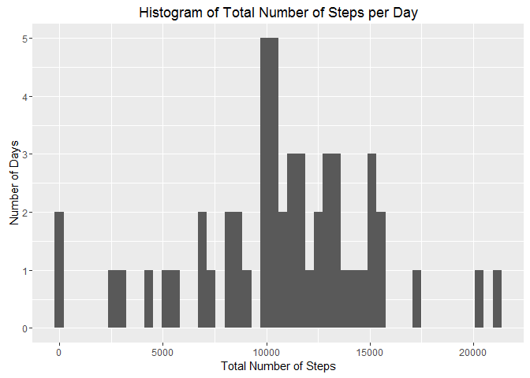
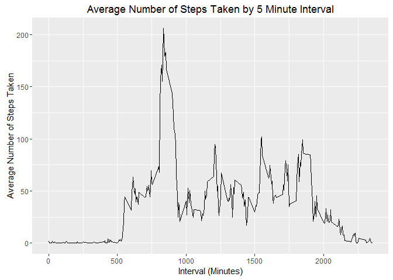
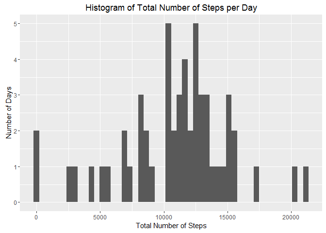
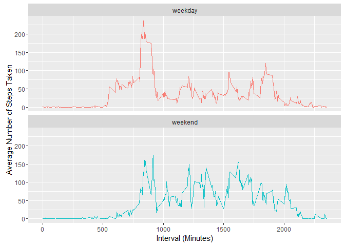

# Reproducible Research: Course Project 1
Keelan Yang  
January 7, 2017  


## Personal Activity Monitoring Device Analysis

It is now possible to collect a large amount of data about personal movement using activity monitoring devices such as a Fitbit, Nike Fuelband, or Jawbone Up. These type of devices are part of the "quantified self" movement - a group of enthusiasts who take measurements about themselves regularly to improve their health, to find patterns in their behavior, or because they are tech geeks. But these data remain under-utilized both because the raw data are hard to obtain and there is a lack of statistical methods and software for processing and interpreting the data.

This assignment makes use of data from a personal activity monitoring device. This device collects data at 5 minute intervals through out the day. The data consists of two months of data from an anonymous individual collected during the months of October and November, 2012 and include the number of steps taken in 5 minute intervals each day.

(from https://www.coursera.org/learn/reproducible-research/peer/gYyPt/course-project-1)


## Load R Libraries

The following R libraries are loaded:

- lubricate
- ggplot2
- dplyr


```r
# Load R libraries
library(lubridate)
```

```
## Warning: package 'lubridate' was built under R version 3.3.2
```

```r
library(ggplot2)
library(dplyr)
```

```
## Warning: package 'dplyr' was built under R version 3.3.2
```


## Loading and preposing the data


The following R code is used to download the zip file  (https://d396qusza40orc.cloudfront.net/repdata%2Fdata%2Factivity.zip) containing the data and to subsequently unzip the data file and process the raw data for analysis:


```r
#  Load zip data file and unzip data files
zipfilename <- "data.zip"
if(!file.exists(zipfilename)) {
  FileURL <- "https://d396qusza40orc.cloudfront.net/repdata%2Fdata%2Factivity.zip"
  download.file(FileURL, zipfilename)
}

if (!file.exists("activity.csv")) { 
  unzip(zipfilename) 
}

#  Read .csv data into rawdata
rawdata <- read.csv("activity.csv")

print("data files downloaded, unzipped, and read into rawdata")
```

```
## [1] "data files downloaded, unzipped, and read into rawdata"
```


## What is the mean total number of steps taken per day?


Below is the histogram plot of the distribution of the total number of steps taken per day.


```r
# Calculate and plot histogram of the total number of steps taken per day

NumSteps <- aggregate(steps ~ date, rawdata, sum)
HistNumSteps <- qplot(steps, data = NumSteps, ylim=c(0,5), bins = 50) + ggtitle("Histogram of Total Number of Steps per Day") + ylab("Number of Days") + xlab("Total Number of Steps")
print(HistNumSteps)
```

<!-- -->


```r
# Calculate mean total number of steps taken per day
NumStepsMean <- format(round(mean(NumSteps$steps, na.rm=TRUE),2), nsmall = 2)
```


```r
# Calculate median total number of steps taken per day
NumStepsMedian <- format(round(median(NumSteps$steps, na.rm=TRUE),2), nsmall = 2)
```


The **mean** of the total number of steps taken per day is **10766.19**.  The **median** of the total number of steps taken per day is **10765.00**.

## What is the average daily pattern?


Below is a graph showing the average number of steps taken for each 5-minute interval.


```r
# Calculate and plot graph of average number of steps taken across all days for each 5-minute time interval

NumSteps5min <- aggregate(steps ~ interval, rawdata, mean)
AveDailyGraph <- ggplot(NumSteps5min, aes(x = interval, y = steps)) + geom_line() + ggtitle("Average Number of Steps Taken by 5 Minute Interval") + xlab("Interval (Minutes)") + ylab("Average Number of Steps Taken")

print(AveDailyGraph)
```

<!-- -->


```r
# Calculate the 5-minute interval with the maximum average number of steps
MaxInterval <- NumSteps5min[NumSteps5min$steps == max(NumSteps5min$steps),][1,1]
```

The maximum average number of steps across all days occurs at the 5-minute interval of **835**. 


##  Imputing missing values


```r
# Calculate the number of NAs
NumNA <- sum(is.na(rawdata))
```

The total number of missing values in the data set is **2304**.  The strategy to fill in these missing values is to take the mean of the weekday and the 5-minute interval.  


```r
# Create NewData dataframe with additional "weekday" column

NewData <- cbind(rawdata, wday(rawdata$date, label = TRUE, abbr = FALSE))
colnames(NewData)[4] <- "weekday"

# Calculate mean steps of the weekday and the 5-minute interval
ImputeDataMean <- aggregate(steps ~ interval + weekday, NewData, mean, na.rm=TRUE)


# Replace missing step values with imputed step values
NumObs <- nrow(NewData)
NumRow <- 1

while(NumRow <= NumObs) {
  if(is.na(NewData$steps[NumRow])) {
    NewData$steps[NumRow] <- ImputeDataMean$steps[which(ImputeDataMean$interval==NewData$interval[NumRow] & ImputeDataMean$weekday ==NewData$weekday[NumRow])]
  }
  NumRow <- NumRow +1
}
```

Below is the histogram plot of the distribution of the total number of steps taken per day after imputing values for the missing values.


```r
# Calculate and plot histogram of the total number of steps taken per day (with imputed values)

NumStepsImpute <- aggregate(steps ~ date, NewData, sum)
HistNumStepsImpute <- qplot(steps, data = NumStepsImpute, ylim=c(0,5), bins = 50) + ggtitle("Histogram of Total Number of Steps per Day") + ylab("Number of Days") + xlab("Total Number of Steps")
print(HistNumStepsImpute)
```

<!-- -->


```r
# Calculate mean total number of steps taken per day
NumStepsMeanImpute <- format(round(mean(NumStepsImpute$steps, na.rm=TRUE),2), nsmall = 2)
```


```r
# Calculate median total number of steps taken per day
NumStepsMedianImpute <- format(round(median(NumStepsImpute$steps, na.rm=TRUE),2), nsmall = 2)
```


The **mean** of the total number of steps taken per day (after imputing missing values) is **10821.21**.  The **median** of the total number of steps taken per day (after imputing missing values) is **11015.00**.

By using a strategy of imputing missing values based on the mean of the weekday and 5-minute interval, the **mean** of the total number of steps taken increased from **10766.19** to **10821.21**. The **median** also increased from **10765.00** to **11015.00**.

## Are there differences in activity patterns between weekdays and weekends?

Below is the code to add to the  data with missing values imputed using the strategy of calculating the mean of the weekday and the 5-minute interval a column specifying whether the date is a weekend or a weekday.


```r
# Create a column that assigns whether the date is a weekend or a weekday

NewData <- mutate(NewData, weekdaytype = ifelse(NewData$weekday == "Saturday" | NewData$weekday == "Sunday", "weekend", "weekday"))
NewData$weekdaytype <- as.factor(NewData$weekdaytype)
```

Below is the panel plot containing a time series plot of the 5-minute interval (x-axis) and the average number of steps taken, averaged across all weekday days or weekend days (y-axis) with missing values imputed.


```r
# Calculate the average number of steps in 5-minute intervals for weekends and weekdays

NewDataMean <- aggregate(steps ~ interval + weekdaytype, NewData, mean)

NewDataMeanPlot <- ggplot(NewDataMean, aes(x = interval, y = steps, color = weekdaytype)) +  facet_wrap(~weekdaytype, nrow = 2, ncol=1) + geom_line() + theme(legend.position="none") + xlab("Interval (Minutes)") + ylab("Average Number of Steps Taken")

print(NewDataMeanPlot)
```

<!-- -->

